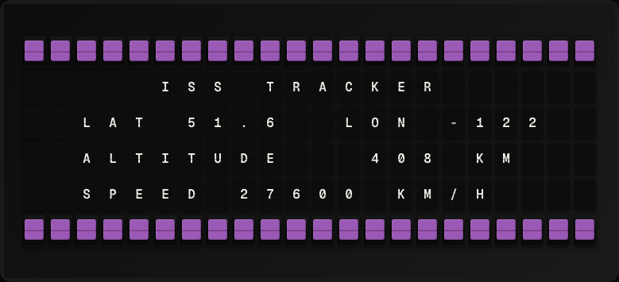

# ISS Tracker Plugin

Display the real-time position and altitude of the International Space Station.



**→ [Setup Guide](./docs/SETUP.md)**

## Overview

The ISS Tracker plugin fetches the current latitude, longitude, and velocity of the ISS every few minutes using the public wheretheiss.at API. No API key is required.

## Template Variables

| Variable | Description | Example |
|---|---|---|
| `iss_tracker.latitude` | Current latitude in decimal degrees | `51.50` |
| `iss_tracker.longitude` | Current longitude in decimal degrees | `-0.13` |
| `iss_tracker.altitude_km` | Altitude above Earth in km | `408.3` |
| `iss_tracker.velocity_kph` | Speed in km/h | `27600` |
| `iss_tracker.visibility` | daylight or eclipsed | `daylight` |

## Example Templates

```
ISS TRACKER
Lat: {{iss_tracker.latitude}}
Lon: {{iss_tracker.longitude}}
Alt: {{iss_tracker.altitude_km}} km
Spd: {{iss_tracker.velocity_kph}} kph
{{iss_tracker.visibility}}
```

## Configuration

| Setting | Name | Description | Required |
|---|---|---|---|
| `refresh_seconds` | Refresh Interval | How often to fetch data (seconds) | No |

## Features

- Real-time ISS position (lat/lon)
- Altitude and velocity data
- Daylight/eclipsed visibility status
- No API key required

## Author

FiestaBoard Team
